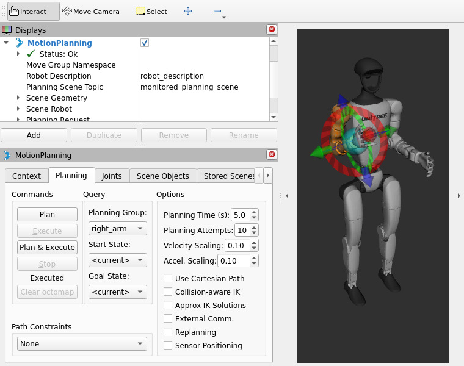

# g1_moveit_config

This package provides MoveIt 2 configuration files for the Unitree G1 humanoid 
robot (29-DoF variant) running on ROS 2 Humble. It includes planning groups 
for both arms, mock hardware interface for simulation, OMPL-based motion 
planning, and JointTrajectoryControllers for arm execution. It is intended as a 
foundation for upper-body manipulation tasks such as pick and place.


<p align="center">
    
    </br>
    <sup>Sample screenshot showing visualization on RViz</sup>
</p>


## Features
- Planning groups for right_arm and left_arm (7-DoF each)
- KDL IK solver configured for both arms
- Mock hardware interface (no real robot required for simulation)
- Joint trajectory controllers for both arms
- Compatible with Unitree G1 29-DoF URDF (g1_description)

## Dependencies
- MoveIt 2
    ```bash
    apt install ros-${ROS_DISTRO}-moveit
    ```
- `ros2_control` and `ros2_controllers`
    ```bash
    apt install ros-${ROS_DISTRO}-ros2-control ros-${ROS_DISTRO}-ros2-controllers
    ```
- [g1_description](https://github.com/isri-aist/g1_description)
    ```bash
    cd ros2_ws/src
    git clone https://github.com/isri-aist/g1_description
    ```

## Launch
```bash
ros2 launch g1_moveit_config demo.launch.py
```